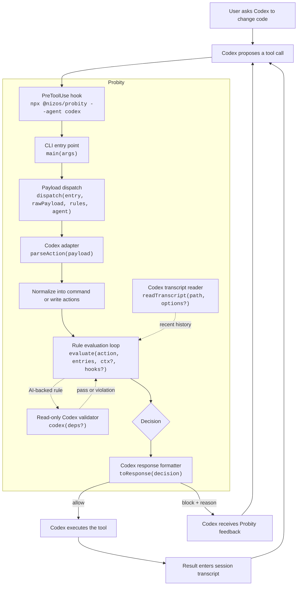

# Probity and Codex integration loop

Each linked node opens the relevant implementation location.

```mermaid
flowchart TD
    U[User asks Codex to change code]
    U --> C[Codex proposes a tool call]
    C --> H["PreToolUse hook<br/><code>npx @nizos/probity --agent codex</code>"]

    subgraph P[Probity]
        H --> B["CLI entry point<br/><code>main(args)</code>"]
        B --> D["Payload dispatch<br/><code>dispatch(entry, rawPayload, rules, agent)</code>"]
        D --> A["Codex adapter<br/><code>parseAction(payload)</code>"]
        A --> N[Normalize into command or write actions]
        N --> E["Rule evaluation loop<br/><code>evaluate(action, entries, ctx?, hooks?)</code>"]

        T["Codex transcript reader<br/><code>readTranscript(path, options?)</code>"]
        T -. recent history .-> E

        E -. AI-backed rule .-> V["Read-only Codex validator<br/><code>codex(deps?)</code>"]
        V -. pass or violation .-> E

        E --> Q{Decision}
        Q --> O["Codex response formatter<br/><code>toResponse(decision)</code>"]
    end

    O -->|allow| X[Codex executes the tool]
    X --> R[Result enters session transcript]
    R --> C

    O -->|block + reason| F[Codex receives Probity feedback]
    F --> C

    click H href "setup.md#L50" "Open the Codex hook setup"
    click B href "../src/bin.ts#L70" "Open the CLI entry point"
    click D href "../src/cli.ts#L48" "Open payload dispatch"
    click A href "../src/vendors/codex/adapter.ts#L88" "Open the Codex adapter"
    click E href "../src/engine.ts#L32" "Open the rule evaluation loop"
    click T href "../src/vendors/codex/transcript.ts#L54" "Open the transcript reader"
    click V href "../src/vendors/codex/agent.ts#L18" "Open the read-only validator"
    click O href "../src/vendors/codex/adapter.ts#L99" "Open the response formatter"
```
